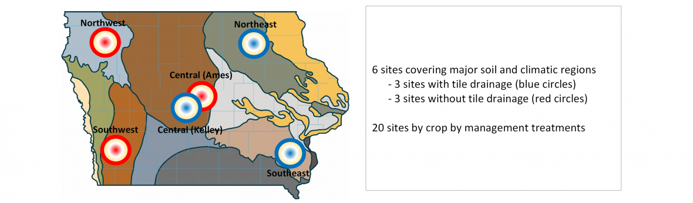

```{r load_data, message=FALSE, warning=FALSE, include=FALSE}
### Examples for creating scenario comparisons 

# Load packages #####################################################
library(tidyverse)
library(ggthemes)
library(lubridate)

# Load data #########################################################
data <- readRDS("data/scenarios.rds")
metYears <- readRDS("data/metYears.rds")

# Source helper code ################################################
source("code/extract_keys.R")

```


## Background

### Forecast and Assessment of Cropping sysTemS ([FACTS](http://crops.extension.iastate.edu/facts/) ): "The FACTS project"
The field season of 2016 saw the [Integrated Cropping systems Lab](http://www.archontoulislab.com/) spent much of its time, money and energy collecting a high-resolution, in-season dataset with many soil and crop measurements from 20 site-crop-management replicated treatments across Iowa .



This data by-itself is valuable, as such high resolution in-season data is rare. Though, the sweat and tears for us was more than just for the data; we were on a quest to provide **quantitative** answers to questions that farmers commonly ask but are not easy to answer:

> What is going to be the yield this year?

> How much nitrogen is in the soil today?

> Do I have enough soil water and nitrogen for the next few days? 

To answer those questions, we used the [Agricultural Production System sIMulator (APSIM)](www.apsim.info), a mechanistic cropping systems model widely used in the U.S. and around the world for research and commercial applications in agriculture. We ran the model with historical, short-term (3 days; using the [NDFD model](http://www.nws.noaa.gov/ndfd) ) and long-term (>90 days; using the [CFS model](https://en.wikipedia.org/wiki/Climate_Forecast_System) ) weather forecasts. Then we use APSIM’s output to provide real-time estimates and forecasts for weather, soil water and nitrogen, crop water and nitrogen uptake, yield predictions, crop staging and heat/frost stresses.

The in-season workflow worked something like this: 1) We seted up model calibration for all experimental sites at the beginning of the season; 2) We then added historical, current, and forecasted weather to drive the model to simulate historical, current, and future field events; 3) We collect ground-truth data (pretty much everything we could) to test our model; and 5) finally, we published the results (simulated and measured data) on our website every 2 weeks. The graph below is one example of the Soil Water content simulated by APSIM and in-season data collected at the NW site in Iowa.


### Hindcast: What if? 

Now that the field season has come to an end, farmers may be asking themselves these kinds of questions:

> What could have I done differently? 

> What if I had used more nitrogen or planted more seeds?

> What if I had gotten more rain?

This is when the model comes in handy. We can basically use the calibrated model to perform a scenario (‘what if’) analysis by making changes in APSIM. For instance, we could change the amount of fertilizer we applied, or the number of seeds planted, or plant our crops in narrower rows, or even add precipitation events. The idea is to evaluate what would have led to a greater yield, less environmental damage, and more profits. This type of analysis also give us the opportunity to evaluate how current management practices and environment performance of cropping systems. 

**One challenge** is that the APSIM output data is messy. Data is reported for each system in an individual text file. Values are reported for every single day, but sometimes we are interested in end of season values, or averages, etc. Values are sometimes stored as variable names (e.g. sw15, sw45, for volumetric soil water content at 15 and 45 cm respectively). This whole picture could get even more messy when trying to simulate scenario analysis that essentially multiply the number of outputs (txt files) by many combinations of management, weather, etc. that we might have. In short, a lot of data processing and tiding is needed before any meaningful information can be drawn from these data. 

**A greater challenge**, however, will be the data flows between collaborators of the research. Dr. Archontoulis (PI of this project), will be in charge of running the simulations for the scenario analysis. It is to be expected that the structure of the data (the outputs requested from APSIM) may change after the team looks.
There is a need of designing a flexible and robust workflow environment where data could still being used even when variables-outputs seem to not have the same name anymore. 

## Objective

What will “success” look like for your project?
You may need more than one.
Potentially consider objectives for this class, as well as long term (if necessary)

1. Create a database from APSIM outputs in a "tidy" format to facilitate analysis.

2. Set up a flexible data process and analysis workflow of APSIM simulation to allow collaboration and reproducibility of our project team it in the long term.

3. Analyse and visualize the model outputs to answer some of the questions targeted through the scenario analysis.

4. Design a shiny web app to be integrated with the [FACTS project](http://crops.extension.iastate.edu/facts/) to be used as a tool to answer particular question in an interactive way.

## Approach

R software will be the main tool to read, clean, reshape, analyze, and visualize the data coming from APSIM simulations. Particular packages such as `dplyr`, `tidyr`, `ggplot2`, and `shiny` will be highly used. 

## Desired outcome:
A  tidy database that includes all output variables from APSIM simulations and a reproducible analysis in form of an interactive shiny web app to visualize data outcomes. 


## Main project deliverables

1. A [github repostiory](https://github.com/laila1986/Agro590_project) that contains:

  1.1 All the raw and tidy datasets

  1.2 R scripts for cleaning, tidyng, and munging

  1.3 Rmd scrips for the reproducible analysis and visualization

2. A shiny webapp for inclusion in the [FACTS hindcast](http://crops.extension.iastate.edu/facts/end-season-evaluation) website 


#Outcomes

## APSIM data generator

```{r, eval=FALSE, include=FALSE}
file.info("data/rawData.zip")

```

```{r, echo=FALSE, message=TRUE, warning=FALSE}
corn_report <- readRDS("data/corn_report.rds")
soybean_report <- readRDS("data/soybean_report.rds")

knitr::kable(data_frame(Factor =names(cornKey),
                        Corn = cornKey,
                        Soybean= c(soybeanKey, NA, NA)),
             caption = "Table 1. Factor levels used for the APSIM scenario analysis")
```

Simulations were conducted using a factorial arragements of the factors shown in Table 1, which produced `r length(corn_report$title)` and `r length(soybean_report$title)` individual factor combinations for corn and soybean, respectively, and for each of these, `r length(unique(metYears$year))` weather years (`r paste(min(metYears$year),max(metYears$year),sep="-")`) were simulated. Some of the simulations contained errors, that is, APSIM crashed and not all years were simulated, but this were a relative small number of simulations: `r length(corn_report$no_years[corn_report$no_years < 36])` (`r paste0( round(length(corn_report$no_years[corn_report$no_years < 36])/length(corn_report$no_years)*100,1),"%")`) of all corn simulations, and `r length(soybean_report$no_years[soybean_report$no_years < 36])` (`r paste0(round(length(soybean_report$no_years[soybean_report$no_years < 36])/length(soybean_report$no_years)*100,1),"%")`) of all soybean simulations. A copy a of all output files from each of the runs in APSIM was storage in the repo in the "rawdata" folder. 


Once we had the raw data sets we used the scripts for extracting and compiling corn and soybean data from APSIM which are the ".out" files (`r list.files("code/")[2:3]`). In those scripts we unzipped the data `utils::TTunzip`, we looped through each of the files to save all the data and also to add the information on the name of the files. The names of the files contain the description of the factors used in each of the simulations. Finaly, we used `base::saveRDS` to save the objects created within the loop in R into a ".rds" object. This allows us to access to the data later on just by reading those objects with the fuction `base:: readRDS`. 

## Data cleaning and tidying

One of the most important things we learnt in class was how make the data "tidy" and the importance of it. Get your data "tidy" means cleaning and structuring the data to facilitate analysis (Hadley Wickham). Part of our initial cleaning involved working with the names of each of the files coming from APSIM. The name of the files containes all the information related to the factors used to simulate the data and we wanted to keep this information as treatment factors in our data set. An example of the names of the files is listed below:

```{r, echo=FALSE}

unique(readRDS("data/corn.rds")[,"title"])[1:3]

```

We used `tidyr::separate()` function to extract the names of the factors using the ";" as separator and `gsub()` to clean the string from unwanted characters. 
The `dply::mutate()` fuction allowed us to add new variables while preserving the existing variables in the data set. 
Using the `dplyr::group by` and the `dply::summarise` fuction we were able to get statistics (mean and standard deviation) for a group of selected variables. 
We classified into "average", "warm and dry", "warm and wet", "cool and dry", and "cool and wet" the weather data used to run the APSIM model and we joined that description with the "soy" or "corn" data, respectively (`dplyr::join left`). 
At the final steps of the data transformation we have several variable () that were names in the columns of the data set, we used `tidyr::gather` to gather the selected columns into key-value pairs of "variable" and "value" make a selection of column names variables that were showing as a name in a column  of the a selection of variables. 

### Weather classification

As metioned above we wanted to keep the classification of the weather as part of our data set. Over the 35 years used to run the simulations there are between 7-8 years representing each of categories.


```{r, echo=FALSE}

head(metYears)

```

```{r, fig.height=4, fig.width=6, message=TRUE, warning=TRUE}

met <- read_table("data/Ames.met",skip = 12,col_names = F)

names <- read_lines("data/Ames.met")[11]
names(met) <- unlist(strsplit(names," "))[unlist(strsplit(names," ")) != ""]

met %>%
  mutate(date = as.Date(day - 1, origin = paste0(year,"-01-01")),
         month = month(date),
         temp = (maxt + mint)*0.5,
         season = ifelse(month %in% 4:10,"growing","winter")) %>%
  filter(year < 2016) %>%
  group_by(year, season) %>%
  summarise(temp = mean(temp),
            rain = sum(rain)) %>% 
  filter(season == "growing") %>%
  select(year,temp,rain) %>%
  left_join(metYears) %>%
  ggplot(aes(temp,rain)) +
  geom_hline(aes(yintercept=median(rain)),linetype = "dotted") +
  geom_vline(aes(xintercept=median(temp)),linetype = "dotted") +
  geom_text(aes(label=substr(year,3,4), colour=climate)) +
  labs(y ="Seasonal precipitation (mm)",
       x = "Seasonal average temperature (oC)",
       colour = "Classification") +
  theme_base()


```

In order to show a selection of levels within each of the factors used for the simulations we created a fuction **Multi Scenario Funtion** in which the levels of each of the factors is selected ramdonmly. For example Table 2 and 3 shows the randomly selected factor for soybean and corn, respectively.

### Multi Scenario function

```{r, echo=TRUE, message=FALSE, warning=FALSE}

scenario_generator <- function(inputs){  
  x <- c()
  for(i in 1:length(inputs)) {
    idx <- sample(1:length(inputs[[i]]), 1)
    x <- c(x,as.character(inputs[[i]][idx]))
    
  }
  x <- data.frame(matrix(x,byrow =T,ncol = length(inputs)))
  names(x) <- names(inputs)  
  return(x)
}

multiscenario_random <- function(inputs,n=3){
  
  if(n > 10) stop("Oooops... Too many scenarios!")
  
  scenarios <-  data.frame()
  
  for(i in 1:n){
    x <- scenario_generator(inputs)
    x$scenario <- paste0(LETTERS[i])
    scenarios <- rbind(scenarios,x)
  }
  return(scenarios)
}

```

To generate a selection of the scenarios we used as an input of the function the **soybeanKey** and the **cornKey** created with the scripts listed below. For each of the crops we extracted the levels of each of the factors using the fuction `base::unique`.


```{r, echo=TRUE, message=FALSE, warning=FALSE}

# Inputs ############################################################

soybeanKey <- list(
  site = unique(data$soybean$site),
  climate = unique(data$soybean$climate),
  maturity = unique(data$soybean$maturity),
  planting = unique(data$soybean$planting),
  residualN = unique(data$soybean$residualN),
  previousCrop = unique(data$soybean$previousCrop),
  waterTable = unique(data$soybean$waterTable)
)

for(i in 1:length(soybeanKey)) { soybeanKey[[i]] <- as.character(soybeanKey[[i]]) }


cornKey <- list(
  site = unique(data$corn$site),
  climate = unique(data$corn$climate),
  maturity = unique(data$corn$maturity),
  planting = unique(data$corn$planting),
  residualN = unique(data$corn$residualN),
  previousCrop = unique(data$corn$previousCrop),
  waterTable = unique(data$corn$waterTable),
  Ntime = unique(data$corn$Ntime),
  Nrate = unique(data$corn$Nrate)
)

for(i in 1:length(cornKey)) { cornKey[[i]] <- as.character(cornKey[[i]]) }
```


One of our maian goals of this project is to have everything well documented in order to make it as much as **reporducible** as possible. We hope this work is the starting point for our Lab group to make future collabaorations and to expand the data set already created here. At this point we believe we made: 

### Scripts for each of our main steps describing the jog to built the data base and a summary of the scenarios for each of the crops
### An organized repo where data and scripts are classify in different folders 
### Relative paths that refer only to the project directory and not to the specific computer
### Script Oon the scripts to keep an order of the steps you need to take in this project


Complementary to the main steps to build a **reproducible** project we created a separate file that explains what everything is (**Data Diccionary**): 

``` {r, }
head(as.data.frame(read_csv("data/dataDictionary_variables.csv")))

```

In this dicctionarry we aimed to have the exact names of each of the variables (name), a version of the name for visualization (variable), and the units in metric and english system (unitSi and unitEng). 


The graps bellow are an overview of some of the main vairables simulated in each of the scenarios and few examples of interesting questions that can be answerd using our data set. One of our final objetives of this work in to create a shiny webapp to be included in the [FACTS hindcast](http://crops.extension.iastate.edu/facts/end-season-evaluation) website. 

## Visualization


### Comparison of selected scenarios for Soybean 

```{r, fig.height=7.5, fig.width=7.5, message=FALSE, warning=FALSE}

scenarioTable_soy <- multiscenario_random(soybeanKey,4)
knitr::kable(select(scenarioTable_soy, scenario, site:waterTable),
             caption = "Table 2. Scenario analysis Soybeans")

scenarioTable_soy %>%
  left_join(data$soybean %>% 
              inner_join(read_csv("data/dataDictionary_variables.csv") %>% filter(userSelect == 1)) %>%
              mutate(mean = mean*convertionFactor + convertionFactor2,
                     sd = sd*convertionFactor + convertionFactor2)) %>%
  ggplot(aes(y=mean, x=scenario)) +
  facet_wrap(~paste0(name," (",unitEng,") "), scales = "free",ncol = 3) +
  geom_bar(aes(fill=paste(scenario,site,climate,maturity,planting,residualN,previousCrop,waterTable,sep=";")),
           stat="identity", colour="black") + 
  geom_errorbar(aes(ymin = mean-sd, ymax=mean+sd), width=0.3) +
  labs(x="",y="",fill="Scenarios:") +
  guides(fill=guide_legend(ncol=1, title.position = "top")) +
  theme_linedraw() + theme(legend.position="none") 
```


###Comparison of selected scnearions for corn

```{r, fig.height=7.5, fig.width=7.5, message=FALSE, warning=FALSE}
# Example of corn ##################################################

scenarioTable_corn <- multiscenario_random(cornKey,4)
knitr::kable(select(scenarioTable_corn, scenario, site:Nrate),
             caption = "Table 3. Scenario analysis Corn")

scenarioTable_corn %>%
  inner_join(data$corn %>% 
              inner_join(read_csv("data/dataDictionary_variables.csv") %>% filter(userSelect == 1)) %>%
              mutate(mean = mean*convertionFactor + convertionFactor2,
                     sd = sd*convertionFactor + convertionFactor2)) %>%
  ggplot(aes(y=mean, x=scenario)) +
  facet_wrap(~paste0(name," (",unitEng,") "), scales = "free",ncol =3) +
  geom_bar(aes(fill=paste(scenario,site,climate,maturity,planting,Ntime,Nrate,residualN,previousCrop,waterTable,sep="; ")),
           stat="identity", colour="black") + 
  geom_errorbar(aes(ymin = mean-sd, ymax=mean+sd), width=0.3) +
  #geom_text(aes(y=1.06*(mean+sd), label=paste0("±",round(cv*100),"%"))) +
  labs(x="",y="",fill="Scenarios:") +
  guides(fill=guide_legend(ncol=1, title.position = "top")) +
  theme_linedraw() + theme(legend.position="none") 

```


### How does the corn yield response to nitrogen change according to the class of year and time of N application? Average maturity group and planting date were selected. 

#### Site: Ames

```{r, fig.height=7.5, fig.width=7.5, message=FALSE, warning=FALSE}
  data$corn %>% 
              inner_join(read_csv("data/dataDictionary_variables.csv") %>% filter(userSelect == 1)) %>%
                         mutate(N.rate= as.numeric(as.character(Nrate)), mean = mean*convertionFactor + convertionFactor2,
                         sd = sd*convertionFactor + convertionFactor2) %>% filter (site== "Ames", maturity =="normal", planting== "1-may", variable== "CornYield") %>%
              ggplot(aes(y= mean, x= Nrate, colour= Ntime)) +
              geom_errorbar(aes(ymin = mean-sd, ymax=mean+sd), width=0.3)+
              xlab(expression (paste("N rate (kg N ",ha^ {- 1}, ")")))+
              ylab(expression(paste("Yield (bu ",ac^{- 1}, ")")))+
              facet_wrap(~ climate)       
                     
```                     
                     
### Site: Cobs

```{r, fig.height=7.5, fig.width=7.5, message=FALSE, warning=FALSE}

data$corn %>% 
              inner_join(read_csv("data/dataDictionary_variables.csv") %>% filter(userSelect == 1)) %>%
                         mutate(N.rate= as.numeric(as.character(Nrate)), mean = mean*convertionFactor + convertionFactor2,
                         sd = sd*convertionFactor + convertionFactor2) %>% filter (site== "Cobs", maturity =="normal", planting== "1-may", variable== "CornYield") %>%
              ggplot(aes(y= mean, x= Nrate, colour= Ntime)) +
              geom_errorbar(aes(ymin = mean-sd, ymax=mean+sd), width=0.3)+
              xlab(expression (paste("N rate (kg N ",ha^ {- 1}, ")")))+
              ylab(expression(paste("Yield (bu ",ac^{- 1}, ")")))+
              facet_wrap(~ climate)


```

### How does the nitrogen uptake change based on the planting data and the maturity of the crop for Ames and Cobs ? Does the water table play a role in this relationships? 

```{r, fig.height=7.5, fig.width=7.5, message=FALSE, warning=FALSE}

data$corn %>% 
              inner_join(read_csv("data/dataDictionary_variables.csv") %>% filter(userSelect == 1)) %>%
                         mutate(mean = mean*convertionFactor + convertionFactor2,
                         sd = sd*convertionFactor + convertionFactor2) %>% filter (Nrate= "200", variable== "CropNupt") %>%
              ggplot(aes(y= mean, x= planting, colour= maturity)) +
              geom_errorbar(aes(ymin = mean-sd, ymax=mean+sd), width=0.3)+
              ylab(expression (paste("N uptake (kg N ",ha^ {- 1}, ")")))+
              xlab("Planting date" )+
              facet_wrap(site~ waterTable)


```

```{r, fig.height=7.5, fig.width=7.5, message=FALSE, warning=FALSE}

data$soybean %>% 
              inner_join(read_csv("data/dataDictionary_variables.csv") %>% filter(userSelect == 1)) %>%
                         mutate(mean = mean*convertionFactor + convertionFactor2,
                         sd = sd*convertionFactor + convertionFactor2) %>% filter ( variable== "CropNupt") %>%
              ggplot(aes(y= mean, x= planting, colour= maturity)) +
              geom_errorbar(aes(ymin = mean-sd, ymax=mean+sd), width=0.3)+
              ylab(expression (paste("N uptake (kg N ",ha^ {- 1}, ")")))+
              xlab("Planting date" )+
              facet_wrap(site~ waterTable)


```


### What are the main factor explaining the variance of each of the variables masured in each of the simulations ?


  
  
  
  
  
  