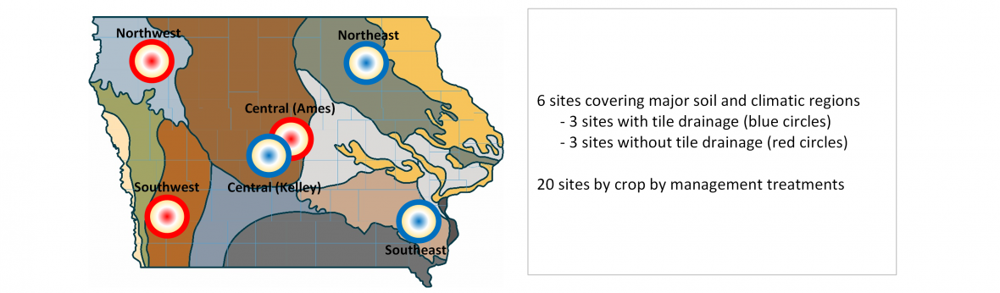

```{r setup, include=FALSE}

library(tidyverse)
library(ggthemes)
library(lubridate)

# Load data #########################################################
data <- readRDS("data/scenarios.rds")
metYears <- readRDS("data/metYears.rds")


# Source helper code ################################################
source("code/extract_keys.R")

```

## Background

"The FACTS project"




##Background

###Not only the data is what it matters!


- What is going to be the yield this year?

- How much nitrogen is in the soil today?

- Do I have enough soil water and nitrogen for the next few days? 


##Background
###APSIM plataform

<div align="center">

</div>


##Background
###In-Season We use APSIM’s output to provide real-time **estimates** and **forecasts** for 

- Weather

- Soil water and nitrogen

- Crop water and nitrogen uptake

- Yield predictions

- Crop staging 


##Background
### Hindcast: What if? 

When the season is over ...there is more work to do! Farmers may be asking themselves these kinds of questions:

> What could have I done differently? 

> What if I had used more nitrogen or planted more seeds?

> What if I had gotten more rain?

##Background

APSIM outputs are messy

```{r}
substr(read_lines("data/outfile_example.txt"), 1,100)[1:10]
```

## Objectives


1. Create a database from APSIM outputs in a **"tidy"** format to facilitate analysis.

2. Set up a flexible data process and analysis workflow of APSIM simulation to allow collaboration and reproducibility of our project team it in the long term.

3. Analyse and visualize the model outputs to answer some of the questions targeted through the scenario analysis.

4. Design a shiny web app to be integrated with the [FACTS project](http://crops.extension.iastate.edu/facts/) to be used as a tool to answer particular question in an interactive way.


## Approach

R software was the main tool used in this project

- Read
- Clean
- Reshape
- Analyze
- VIsualize

Particular packages such as `dplyr`, `tidyr`, `ggplot2`, and `shiny` were highly used. 


## Project Outputs

1. A [github repostiory](https://github.com/laila1986/Agro590_project) that contains:

  1.1 All the raw and tidy datasets

  1.2 R scripts for cleaning, tidyng, and munging

  1.3 Rmd scrips for the reproducible analysis and visualization

2. A shiny webapp for inclusion in the [FACTS hindcast](http://crops.extension.iastate.edu/facts/end-season-evaluation) website 


## Scenarios in APSIM / Data generation

```{r, echo=FALSE}
corn_report <- readRDS("data/corn_report.rds")
soybean_report <- readRDS("data/soybean_report.rds")

knitr::kable(data_frame(Factor =names(cornKey),
                        Corn = cornKey,
                        Soybean= c(soybeanKey, NA, NA)),
             caption = "Table 1. Factor levels used for the APSIM scenario analysis")
```

##Data cleaning and tidying

The factors used for each simulation are trapped in the file name! 
```{r, echo=FALSE}

unique(readRDS("data/corn.rds")[,"title"])[1]

```

To "free" them we used: 

- `tidyr::separate()`
- `gsub()`
- `dplyr::group by` and `dplyr::summarise`
- `dplyr::join left`
- `tidyr::gather`


## Data cleaning and tidying
### Data diccionary and keynames

- SoybeanKey and CornKey

- Data diccionary: names of each of the variables (name), a version of the name for visualization (variable), and the units in metric and english system (unitSi and unitEng). 


```{r, echo=FALSE}

head(data.frame(read.csv("data/dataDictionary_variables.csv")),6)

```

## Data cleaning and tidying
### Weather

We used the weather data and classified it into 5 categories: `r levels(metYears$climate)`

```{r, echo=FALSE}
metYears[sort(sample(1:length(metYears$year),6)), ]
```

## Data cleaning and tidying
### Weather


```{r, echo=FALSE, fig.height=4, fig.width=6, message=TRUE, warning=TRUE}

met <- read.table("data/Ames.met",skip = 12,header = FALSE)

names <- read_lines("data/Ames.met")[11]
names(met) <- unlist(strsplit(names," "))[unlist(strsplit(names," ")) != ""]

met %>%
  mutate(date = as.Date(day - 1, origin = paste0(year,"-01-01")),
         month = month(date),
         temp = (maxt + mint)*0.5,
         season = ifelse(month %in% 4:10,"growing","winter")) %>%
  filter(year < 2016) %>%
  group_by(year, season) %>%
  summarise(temp = mean(temp),
            rain = sum(rain)) %>% 
  filter(season == "growing") %>%
  select(year,temp,rain) %>%
  left_join(metYears, by="year") %>%
  ggplot(aes(temp,rain)) +
  geom_hline(aes(yintercept=median(rain)),linetype = "dotted") +
  geom_vline(aes(xintercept=median(temp)),linetype = "dotted") +
  geom_text(aes(label=substr(year,3,4), colour=climate)) +
  labs(y ="Seasonal precipitation (mm)",
       x = "Seasonal average temperature (oC)",
       colour = "Classification") +
  theme_base()


```

## Data Analysis and Visualization 


## Yield Resonse to N by year type and application method

```{r, echo=FALSE, message=FALSE, warning=FALSE}
data$corn %>%
  inner_join(read.csv("data/dataDictionary_variables.csv") %>% filter(userSelect == 1),by="variable") %>%
  mutate(N.rate= as.numeric(as.character(Nrate)), mean = mean*convertionFactor + convertionFactor2,
         sd = sd*convertionFactor + convertionFactor2) %>% filter(maturity =="normal", planting== "1-may", variable== "CornYield") %>%
  group_by(site, Ntime, Nrate, climate) %>%
  summarise(mean=mean(mean,na.rm=T), sd=sd(sd,na.rm=T)) %>%
  ggplot(aes(y= mean, x= as.numeric(as.character(Nrate)), colour= Ntime, shape=site)) +
  geom_point() +
  geom_line() + 
  geom_errorbar(aes(ymin = mean-sd, ymax=mean+sd), width=10)+
  labs(x= expression(paste("N rate (kg N ",ha^ {- 1}, ")")),
       y = expression(paste("Yield (bu ",ac^{- 1}, ")")),
       colour = "", 
       shape = "")+
  facet_wrap(~climate) + 
  theme_base() + theme(legend.position = "top")


```


## Soybean uptake response to planting date and Maturity

```{r, echo=FALSE, message=FALSE, warning=FALSE}

data$soybean %>% 
  filter (waterTable == "1200", variable == "CropNupt") %>%
  group_by(planting, maturity) %>%
  summarise(mean=mean(mean,na.rm=T), sd=mean(sd,na.rm=T)) %>%
  ggplot(aes(y= mean, colour=maturity, x = yday(as.Date(paste0(planting,"-2016"), format = "%d-%B-%Y")))) +
  geom_point() +
  geom_smooth(method = "lm", formula = y ~ poly(x,2), se=F) + 
  geom_errorbar(aes(ymin = mean-sd, ymax=mean+sd), width=0.3) +
  labs(y = expression(paste("N uptake (kg N ",ha^ {- 1}, ")")),
       x = "Planting date (doy)",
       colour = "Maturity")+
  #facet_grid(.~maturity) + 
  theme_base() + theme(legend.position = "top")

```


## Where does the most of variation in responses comes from?
### Corn
```{r, echo=FALSE, message=FALSE, warning=FALSE}

data$corn %>%
  inner_join(read.csv("data/dataDictionary_variables.csv") %>% select(variable,userSelect,name),by="variable") %>%
  filter(userSelect == 1) %>%
  mutate(name = gsub(" ","_",name)) %>%
  group_by(site, maturity, Ntime, Nrate, planting, residualN, previousCrop, waterTable, climate) %>% 
  select(-sd,-cv, -userSelect,-variable) %>%
  spread("name", "mean") -> cornModels

cornVars <- data.frame()

for(i in 10:length(cornModels)) {
  y <- unlist(cornModels[,i], use.names = FALSE)
  modCorn <- lm(y ~ maturity + Ntime + as.numeric(as.character(Nrate)) + as.character(planting) + as.numeric(as.character(residualN)) + previousCrop + as.numeric(as.character(waterTable)) + climate,
                data=cornModels)
  cornVars <- rbind(cornVars,
                    data.frame(y = names(cornModels)[i],
                               factor = c( "maturity", "Ntime", "Nrate", "planting", "residualN", "previousCrop", "waterTable", "climate","_modelResiduals"),
                               percentVar = sqrt(anova(modCorn)$`Mean Sq`)/sum(sqrt(anova(modCorn)$`Mean Sq`))*100))
}

ggplot(data=cornVars, aes(y,percentVar,fill=factor)) + 
  geom_bar(stat = "identity", colour = "black") + 
  labs(x="", y="% Variance", fill="") + 
  coord_flip() +
  theme_bw() + theme(text = element_text(size=10), legend.position = "bottom")


```

## Where does the most of variation in responses comes from?
### Soybean

```{r, echo=FALSE, message=FALSE, warning=FALSE}

data$soybean %>%
  inner_join(read.csv("data/dataDictionary_variables.csv") %>% select(variable,userSelect,name),by="variable") %>%
  filter(userSelect == 1) %>%
  mutate(name = gsub(" ","_",name)) %>%
  group_by(site, maturity,planting, residualN, previousCrop, waterTable, climate) %>% 
  select(-sd,-cv, -userSelect,-variable) %>%
  spread("name", "mean") -> soyModels

soyVars <- data.frame()

for(i in 10:length(soyModels)) {
  y <- unlist(soyModels[,i], use.names = FALSE)
  modSoy <- lm(y ~ maturity + as.character(planting) + as.numeric(as.character(residualN)) + previousCrop + as.numeric(as.character(waterTable)) + climate,
                data=soyModels)
  soyVars <- rbind(soyVars,
                    data.frame(y = names(soyModels)[i],
                               factor = c( "maturity","planting", "residualN", "previousCrop", "waterTable", "climate","_modelResiduals"),
                               percentVar = sqrt(anova(modSoy)$`Mean Sq`)/sum(sqrt(anova(modSoy)$`Mean Sq`))*100))
}

ggplot(data=soyVars, aes(y,percentVar,fill=factor)) + 
  geom_bar(stat = "identity", colour = "black") + 
  labs(x="", y="% Variance", fill="") + 
  coord_flip() +
  theme_bw() + theme(text = element_text(size=10), legend.position = "bottom")


```

## Scenario comparison
### scenario_generator function

To test that all the scenarios run properly, let's leave to chance. 

```{r, echo=TRUE, message=FALSE, warning=FALSE}

scenario_generator <- function(inputs){  
  x <- c()
  for(i in 1:length(inputs)) {
    idx <- sample(1:length(inputs[[i]]), 1)
    x <- c(x,as.character(inputs[[i]][idx]))
    
  }
  x <- data.frame(matrix(x,byrow =T,ncol = length(inputs)))
  names(x) <- names(inputs)  
  return(x)
}
```

## Scenario comparison
### multiscenario_random function
```{r, echo=TRUE, message=FALSE, warning=FALSE}
multiscenario_random <- function(inputs,n=3){
  
  if(n > 10) stop("Oooops... Too many scenarios!")
  
  scenarios <-  data.frame()
  
  for(i in 1:n){
    x <- scenario_generator(inputs)
    x$scenario <- paste0(LETTERS[i])
    scenarios <- rbind(scenarios,x)
  }
  return(scenarios)
}

```

## Scenario comparison: Soybean 
```{r, echo=TRUE, fig.height=7.5, fig.width=7.5}
scenarioTable_soy <- multiscenario_random(soybeanKey,5)
```

```{r, echo=FALSE}
knitr::kable(select(scenarioTable_soy, scenario, site:waterTable),
             caption = "Table 2. Scenario analysis Soybeans")
```


## Scenario comparison: Soybean

```{r, echo=FALSE, message=FALSE, warning=FALSE}

scenarioTable_soy %>%
  left_join(data$soybean %>% 
              inner_join(read_csv("data/dataDictionary_variables.csv") %>% filter(userSelect == 1)) %>%
              mutate(mean = mean*convertionFactor + convertionFactor2,
                     sd = sd*convertionFactor + convertionFactor2)) %>%
  ggplot(aes(y=mean, x=scenario)) +
  facet_wrap(~paste0(name," (",unitEng,") "), scales = "free",ncol = 4) +
  geom_bar(aes(fill=paste(scenario,site,climate,maturity,planting,residualN,previousCrop,waterTable,sep=";")),
           stat="identity", colour="black") + 
  geom_errorbar(aes(ymin = mean-sd, ymax=mean+sd), width=0.3) +
  labs(x="",y="",fill="Scenarios:") +
  guides(fill=guide_legend(ncol=1, title.position = "top")) +
  theme_base() + theme(legend.position="none", text = element_text(size=8)) 
```

## Scenario comparison: Corn

```{r, echo=TRUE}
scenarioTable_corn <- multiscenario_random(cornKey,5)
```

```{r, echo=FALSE}
knitr::kable(select(scenarioTable_corn, scenario, site:Nrate),
             caption = "Table 3. Scenario analysis Corn")
```

## Scenario comparison: Corn
```{r, echo=FALSE, message=FALSE, warning=FALSE}

scenarioTable_corn %>%
  inner_join(data$corn %>% 
              inner_join(read_csv("data/dataDictionary_variables.csv") %>% filter(userSelect == 1)) %>%
              mutate(mean = mean*convertionFactor + convertionFactor2,
                     sd = sd*convertionFactor + convertionFactor2)) %>%
  ggplot(aes(y=mean, x=scenario)) +
  facet_wrap(~paste0(name," (",unitEng,") "), scales = "free",ncol =5) +
  geom_bar(aes(fill=paste(scenario,site,climate,maturity,planting,Ntime,Nrate,residualN,previousCrop,waterTable,sep="; ")),
           stat="identity", colour="black") + 
  geom_errorbar(aes(ymin = mean-sd, ymax=mean+sd), width=0.3) +
  #geom_text(aes(y=1.06*(mean+sd), label=paste0("±",round(cv*100),"%"))) +
  labs(x="",y="",fill="Scenarios:") +
  guides(fill=guide_legend(ncol=1, title.position = "top")) +
  theme_base() + theme(legend.position="none", text = element_text(size=8))

```

# Next Steps

## Build a shiny app for interactive analysis

- Use `shinydashboard` library

```{r, eval=FALSE, include = TRUE}

# Header 
header <- dashboardHeader(
  title = "Pre-season Tool"
)

# Sidebar
sidebar <- dashboardSidebar(
  sidebarMenu(
    h3("Select crop"),
    menuItem("Corn", tabName = "Corn", icon = icon("leaf")),
    menuItem("Soybean", tabName = "Soybean", icon = icon("leaf"))
  )
)

# Body

body <- dashboardBody(
  # 
  p(
    class = "text-muted",
    paste("SOME TEXT HERE."
    )
  ),

  tabItems(
    # CORN TAB
    tabItem(tabName = "Corn",
            h2("Corn"),
              tabBox(title = "Create scenario", width = 12,
                     selected = "Site >",
                     tabPanel("Site >",radioButtons("select_corn_site", "",choices = as.character(cornKey$site),selected = "Ames")),
                     tabPanel("Climate >" ,radioButtons("select_corn_climate", "",choices = as.character(cornKey$climate),selected = "Average")),
                     tabPanel("Maturity >" ,radioButtons("select_corn_maturity", "Relative maturity",choices = as.character(cornKey$maturity),selected = "normal")),
                     tabPanel("Planting >" ,radioButtons("select_corn_planting", "Planting date (dd-mm)",choices = as.character(cornKey$planting),selected = "1-may")),
                     tabPanel("Initial Conditions >",
                              radioButtons("select_corn_previousCrop", "Previous crop",choices = as.character(cornKey$previousCrop),selected = "soy"),
                              radioButtons("select_corn_waterTable", "Water table depth (in)",choices =round(as.numeric(as.character(cornKey$waterTable))/25.4,0),selected = "40"),
                              radioButtons("select_corn_residualN", "Residual N (lb/a)",choices = round(as.numeric(as.character(cornKey$residualN))/1.12,0),selected = "17")
                     ),
                     tabPanel("N fertilizer >",
                              radioButtons("select_corn_Nrate", "Rate (lb N/a)",choices = round(as.numeric(as.character(cornKey$Nrate))/1.12,0),selected = "134"),
                              radioButtons("select_corn_Ntime", "Source and timing",choices = as.character(cornKey$Ntime),selected = "UAN injected at planting")),
                     tabPanel("Add Scenario",textInput("select_corn_scenarioName", "Type scenario name:" , "Home field"),
                              actionButton("add_botton", "Add scenario"),
                              actionButton("clearLast_botton", "Delete last"),
                              actionButton("clearAll_botton", "Clear all"))
                     ),
              box(width = 12,"Saved scenarios",
                  tableOutput("corn_scenarios")
                  ),
            fluidRow(
              column(width = 3,
                  box(width = NULL, status = "warning",
                      uiOutput("routeSelect"),
                      checkboxGroupInput("select_variables", "Show",
                                        choices = c(variables),
                                        selected = c(1:15)
                      ),
                      actionButton("variable_botton", "Update")
                     )
                  ),
              column( width = 9,
                  box(width = NULL, status = "warning",
                      uiOutput("routeSelect"),
                      checkboxGroupInput("select_variables", "Show",
                                         choices = c(variables),
                                         selected = c(1:15)
                      ),
                      actionButton("variable_botton", "Update")
                      )
                  )
              )
    ),
    
    # SOYBEAN TAB
    tabItem(tabName = "Soybean",
            h2("Soybean")
    )
  )
)


# UI

ui <- dashboardPage(
  header,
  sidebar,
  body,
  skin = "red"
)

# Server #############################################################

server <- function(input, output) {
  output$corn_scenarios <- renderTable(multiscenario_random(cornKey,3))
}

# Run app ############################################################

shinyApp(ui, server)
```